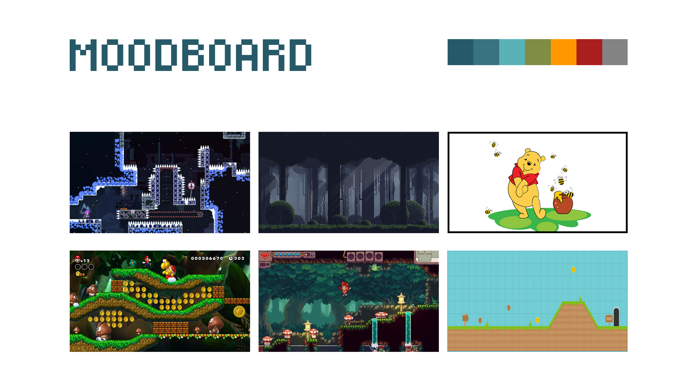

# Bienvenue dans mon répertoire!

Voici mon répositoire Github pour le travail personel 4 de Godot en interactivité ludique (Collège Montmorency A25). 

Ce répositoire contient mon projet "Wunu world". Ce jeu est succédé du travail personel 3 (https://github.com/PerformX2/cruz_nicolas_tp3_582301MO.git) en interactivité ludique (Collège Montmorency A25). Contrairement au travail personel 3, le travail personel 4 est une version prête à être publiée. Avant, il n'y avait aucune situation d'échec dans mon jeu. Maintenant, il y a des abeilles qui peuvent faire perdre des vies au joueur.

Ce jeu a été fait par Nicolas Cruz. C'est un jeu d'aventure en 2D de type platformer. Ce projet a été fait individuellement sur Godot (4.4.1_stable_win64). J'ai publié Wunu World en version HTML pour le jouer en version web.

Lien jouable Github: (https://performx2.github.io/cruz_nicolas_tp4_582301MO/)
Lien jouable Itch.io: (https://performx2.itch.io/wunu-world)

## Moodboard

### Sources des médias utilisés dans le "Moodboard":

Celeste gameplay : 
(https://www.reddit.com/r/celestegame/comments/1mvj7sr/how_do_you_get_past_this/)

Mario Bros Wii gameplay : 
(https://mario.fandom.com/wiki/Jungle_of_the_Giants?file=NSMBU_Jungle_of_the_Giants_Screenshot.png)

Platformer idea :
(http://blog.schockwellenreiter.de/2021/04/2021042901.html)

Pixel art platformer :
(https://80.lv/articles/eagle-island-pixel-art-platformer-about-owls)

Dark forest :
(https://www.gamedevmarket.net/asset/free-pixel-art-forest)

Winnie the pooh image :
(https://www.vectorstock.com/royalty-free-vector/winnie-the-pooh-with-honey-and-bees-vector-26463312)
